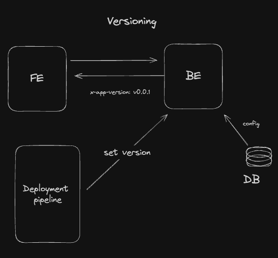

# Frontend Application Version Management

The usual SPA (Single Page Application) is a bunch of static files that are served by a web server. The browser
downloads those files and the user interacts with the application. Due to the nature of the SPA, there are no full-page
reloads, which means that the browser will not download the new version of the app when you change the route.

The problem with this approach is that your users may have an old version of the app for a very long time. This can cause
some issues.

### Real-world example

Me and my team were working on a project and we needed to add a new small improvement. The idea was in case the user
didn't start any learning track, we would randomly assign one to him, that's the business rule.
We wrote 2 queries via react-query. During the process we noticed that there was a chance to have a circular dependency
between requests, we tested it and no issues were found. Perfect, commit, push, open PR, merge, deploy, done.

But as usual with software and people, something goes wrong. I don't know how we tested it, but anyway, that code started to
create hundreds of requests to the backend. You can have a similar experience if you forget to add `[]` to the `useEffect`
hook.

I saw through the back-end logs that hundreds of requests were coming from the same user. We quickly fixed the issue and
deployed the app again. The problem was that the user left their browser open and went away. So the browser could not download
the fix, and we still had hundreds of requests coming to our API.

The access token lifetime was 1 hour, so even when I removed their refresh token from the DB, they could still be active
for an hour causing trouble. Fortunately, that was our client's account, so we had to call them and ask to find the PC 
where the bug was present and refresh the page. As you may guess, that's not the best experience.

### Solution

To solve this problem, we need to somehow track the version of the FE app deployed and signal to the old apps that they
need to refresh the page.



The solution I came up with is the following – we need to have a config key in the BE that will contain the newest version of
the app. The BE will return that key in the response headers, something like `x-app-version: 0.0.1` and based on that
we can schedule an update.

The easiest version to use is the commit sha of the version you are deploying. This version will be injected during
build as `import.meta.env.PUBLIC_APP_VERSION` and then you need to execute some `curl` command that will
send the new version to the API.

On the frontend side, we have request interceptors, so whenever we receive a response from the API, we check the headers
with that `import.meta.env.PUBLIC_APP_VERSION` and if they are not equal, we schedule an update.

Now, we can't update the app immediately, because it's a horrible experience for the user. So the better option is to 
refresh on the route change or when the user is idle.

So your GitHub actions pipeline will look something like

```yaml
  - name: Set app version
    run: |
     version=${{ github.sha }}:0:7
     echo -e "\nPUBLIC_APP_VERSION=$version" >> .env
     echo "APP_VERSION=$version" >> "$GITHUB_ENV"

  - name: Build
    run: pnpm run build

  - name: Deploy
    run: ...

  - name: Update version config
    run: |
      curl -i -X PATCH "${{ env.API_BASE_URL }}configs/version" -H "Content-Type: application/json" -H "x-api-key: ${{ secrets.api_key}}" --data "{ \"version\": \"${{ env.APP_VERSION }}\" }"
```

in your code, you can create something like a `VersionManger` class that will have a method to set the version and to sync

```ts
interface VersionManager {
  setVersion(version: string): void;
  sync(): void;
}
```

You can add additional checks to limit the number of reloads per hour or their frequency in case something goes wrong.
