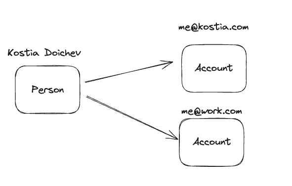
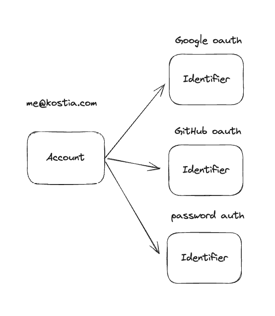
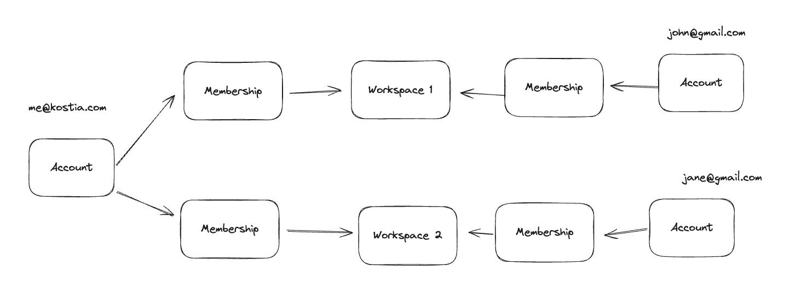

## Concept

There is a concept I keep thinking about for quite some time already.
A lot of the web applications (stress on applications) that I interact with could be described as
workspace-based application. Whenever you sign up,
you either join or create some kind of a workspace/group/organization.
Most of those applications are productivity applications
that expect users to sign in every day to perform some activities.
Furthermore, users can have multiple authentication methods or even accounts in general.
You can have a personal account, a work account, a family account, etc.

The ideal user experience for such kind of applications is to seamlessly switch not only between workspaces, but also
accounts.

I haven't implemented a real-world app with this concept, but I had some sandboxes where I found a particular model.

## Model

We start with basics: a human can have multiple accounts


As we have specs like OIDC (OpenID Connect) and OAuth, each account should have multiple identifiers


An account can have a google oauth together with a basic email-password auth. It's weird, but possible

Lastly, the relation between the account and workspaces is bridged via memberships


The precise data schema depends on your business needs.

For instance, is email a required property an account should have?
If so, then the account entity should have `email` and something like `emailVerificationTime` properties.

Next question is: Should you link the oauth identifiers to the account with the same email automatically?
We could first require the email to be verified and then prompt the user with confirmation by email.

What about passwords? Should those be stored in the identifier entity (hashed of course) or it's an ID/Foreign Key of
the
password entity that is stored in a separate table or even database?

What's for the invites? Is that a separate entity that has a membership or it's an account with unverified email?

## UX

After the user has authenticated, we should have 2 types of session data:

- auth tokens
- auth state

The auth tokens is basically a map of the account ID and their token

```json
{
  "acc_123": "eyJhbGciOiJIUzI1NiIsInR5cCI6IkpXVCJ9...",
  "acc_456": "eyJhbGciOiJIUzI1NiIsInR5cCI6IkpXVCJ9..."
}
```

The auth state is a bit more interesting. Not only should it include the information regarding the currently
authenticated account, but also about all the accounts that the person authenticated for.
The example structure

```json
{
  "currentAccountID": "acc_123",
  "currentMemberID": "mem_123",
  "accounts": {
    "acc_123": {
      "id": "acc_123",
      "displayName": "Personal",
      "memberships": {
        "mem_123": {
          "id": "mem_123",
          "type": "owner",
          "workspace": {
            "id": "ws_123",
            "slug": "personal"
          }
        }
      }
    },
    "acc_456": {
      "id": "acc_456",
      "displayName": "Work",
      "memberships": {
        "mem_456": {
          "id": "mem_456",
          "type": "member",
          "workspace": {
            "id": "ws_456",
            "slug": "work"
          }
        }
      }
    }
  }
}
```

Again, the specific implementations depends on many things.

- Instead of auth tokens we could store auth session IDs
- We could use one JWT that stores all the auth state and get rid of auth tokens.
- If we use JWT then it's probably better not to use HTTP only cookies, as the client application may use the JWT
  payload information. But then the tokens should be short-lived to prevent wrongful impersonation
- How would refresh tokens be structured when using short-lived JWTs?

## Conclusion

Overall, this concept seems to click for many productivity web applications where people have to deal with multiple
digital identities. In the future I'll try to implement an application following the above-written ideas and
will update this blog post.
